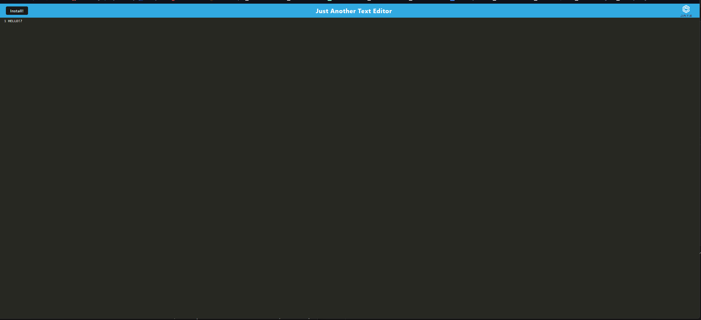

# PWA IndexDB Code Editor
  

  ## Description
  This is an example of a PWA that uses indexDB to store data in cache. This is designed to capture info in the cache, then use GET and PUT methods to restore the data
  
  ## Table of Contents
  - [Installation](#installation)
  - [Usage](#usage)
  - [License](#license)
  - [Contributing](#contributing)
  - [Questions](#questions)
  
  ## Installation
  Go to the posted link, then click on the install me button! 
  
  ## Usage
  [Visit the PWA App](https://pwa-app-module19-29ed7ef5b346.herokuapp.com)

  

  ## License
 This project is licensed under the [MIT](https://opensource.org/licenses/MIT) license.
  
  ## Contributing
  Initial Code was provided to me by my boot camp course. The putDB getDB functions found in the database.js were provided by the bootcamp as well, but contains comments of my own writing to explain what each line of the functions do as well as to show understanding for that function. Any other edits are my own. 

IndexedDB. The Modern JavaScript Tutorial. (2022, June 20). https://javascript.info/indexeddb 

MozDevNet. (n.d.). Progressive web apps. MDN. https://developer.mozilla.org/en-US/docs/Web/Progressive_web_apps 

  
  ## Questions
  if you have any questions, you can reach me @ [ErgonomicQ](https://github.com/ErgonomicQ) or shoot me email at c.s.cooke89@.gmail.com.
  